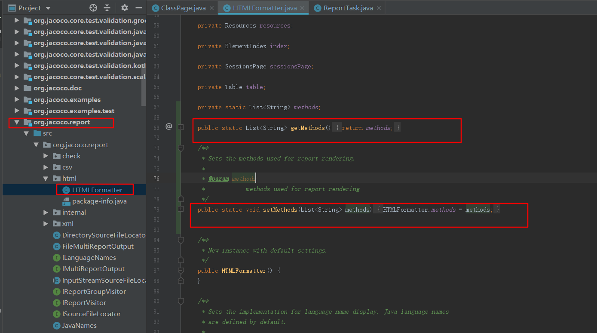
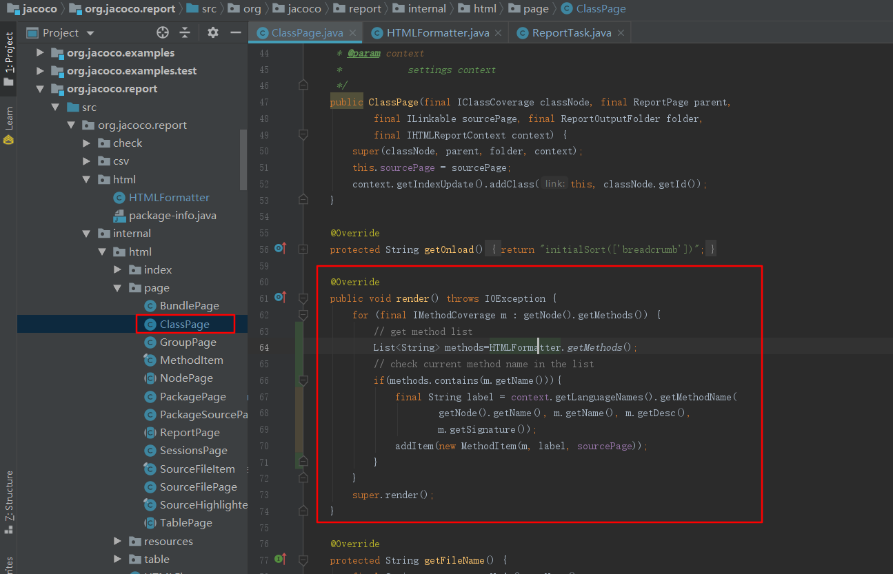
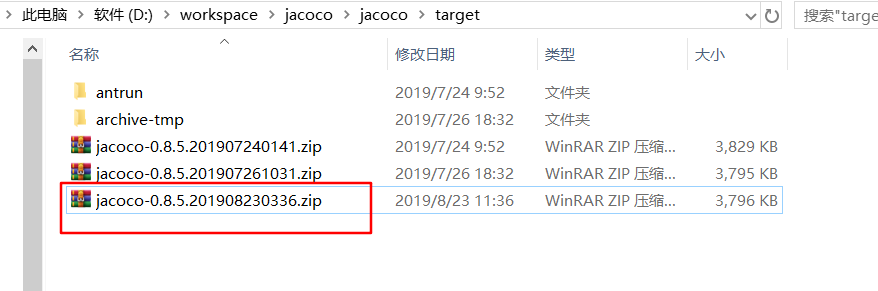
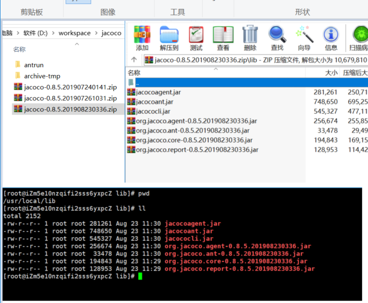
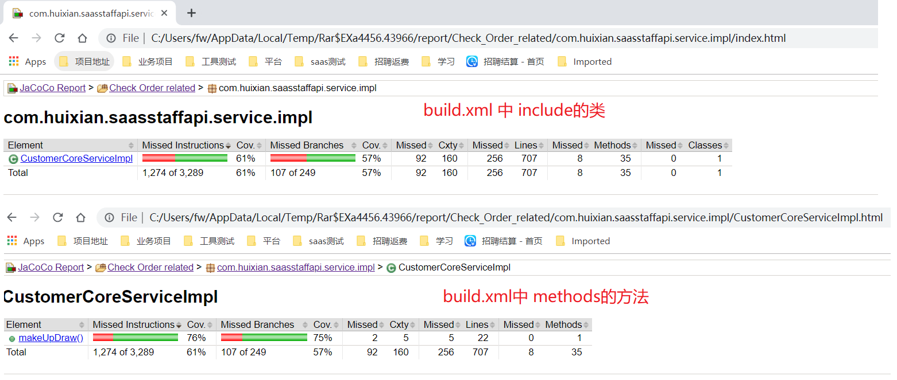
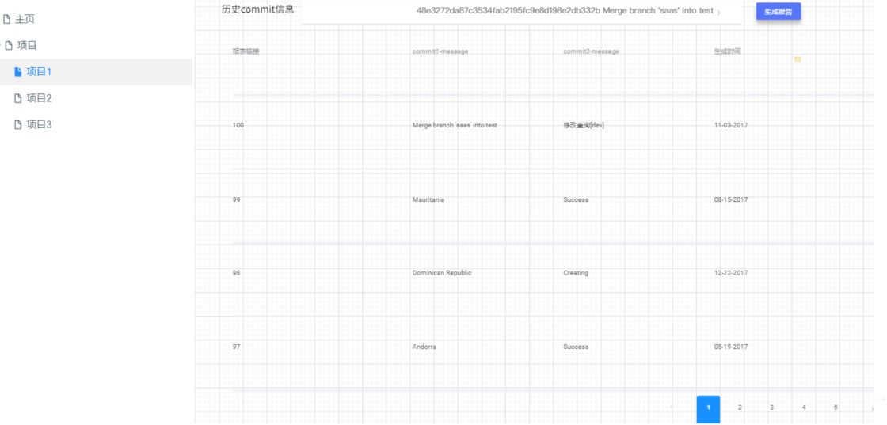

[TOC]
## 一、修改jacoco源码、支持include类的方法颗粒度报告
1.ReportTask类

```java
public class ReportTask extends Task {

    private static List<String> names=new ArrayList<String>();//新增代码
    public static List<String> getMethods(){
        return names;//新增代码
    }
    /**
     * The source files are specified in a resource collection with additional
     * attributes.
     */
    public static class SourceFilesElement extends Union {

        String encoding = null;

        int tabWidth = 4;

        /**
         * Defines the optional source file encoding. If not set the platform
         * default is used.
         *
         * @param encoding source file encoding
         */
        public void setEncoding(final String encoding) {
            this.encoding = encoding;
        }

        /**
         * Sets the tab stop width for the source pages. Default value is 4.
         *
         * @param tabWidth number of characters per tab stop
         */
        public void setTabwidth(final int tabWidth) {
            if (tabWidth <= 0) {
                throw new BuildException("Tab width must be greater than 0");
            }
            this.tabWidth = tabWidth;
        }

    }
    /**
     * The source methods are specified in a resource collection with additional
     * attributes.
     */
     //新增代码
    public static class MethodElement extends Union {
        String names = null;
        /**
         * Sets the names.
         *
         * @param names content split is dot.
         */
        public void setNames(final String names){
            this.names=names;
            String[] methods=this.names.split(",");
            for(int i=0;i<methods.length;i++){
                String method=methods[i];
                ReportTask.names.add(method);
            }
        }
    }

    /**
     * Container element for class file groups.
     */
    public static class GroupElement {

        private final List<GroupElement> children = new ArrayList<GroupElement>();

        private final Union classfiles = new Union();

        private final SourceFilesElement sourcefiles = new SourceFilesElement();

        private String name;
        //新增代码
        private final MethodElement methods = new MethodElement();

        /**
         * Sets the name of the group.
         *
         * @param name name of the group
         */
        public void setName(final String name) {
            this.name = name;
        }

        /**
         * Returns the nested resource collection for methods string content.
         *
         * @return resource string for methods
         */
        public MethodElement createMethods() {
            return methods;//新增代码
        }

        /**
         * Creates a new child group.
         *
         * @return new child group
         */
        public GroupElement createGroup() {
            final GroupElement group = new GroupElement();
            children.add(group);
            return group;
        }

        /**
         * Returns the nested resource collection for class files.
         *
         * @return resource collection for class files
         */
        public Union createClassfiles() {
            return classfiles;
        }

        /**
         * Returns the nested resource collection for source files.
         *
         * @return resource collection for source files
         */
        public SourceFilesElement createSourcefiles() {
            return sourcefiles;
        }

    }

-----------------------------------------------------------------------


public class HTMLFormatterElement extends FormatterElement {

        private File destdir;

        private File destfile;

        private String footer = "";

        private String encoding = "UTF-8";

        private Locale locale = Locale.getDefault();

        /**
         * Sets the output directory for the report.
         *
         * @param destdir output directory
         */
        public void setDestdir(final File destdir) {
            this.destdir = destdir;
        }

        /**
         * Sets the Zip output file for the report.
         *
         * @param destfile Zip output file
         */
        public void setDestfile(final File destfile) {
            this.destfile = destfile;
        }

        /**
         * Sets an optional footer text that will be displayed on every report
         * page.
         *
         * @param text footer text
         */
        public void setFooter(final String text) {
            this.footer = text;
        }

        /**
         * Sets the output encoding for generated HTML files. Default is UTF-8.
         *
         * @param encoding output encoding
         */
        public void setEncoding(final String encoding) {
            this.encoding = encoding;
        }

        /**
         * Sets the locale for generated text output. By default the platform
         * locale is used.
         *
         * @param locale text locale
         */
        public void setLocale(final String locale) {
            this.locale = parseLocale(locale);
        }

        @Override
        public IReportVisitor createVisitor() throws IOException {
            final IMultiReportOutput output;
            if (destfile != null) {
                if (destdir != null) {
                    throw new BuildException(
                            "Either destination directory or file must be supplied, not both",
                            getLocation());
                }
                final FileOutputStream stream = new FileOutputStream(destfile);
                output = new ZipMultiReportOutput(stream);

            } else {
                if (destdir == null) {
                    throw new BuildException(
                            "Destination directory or file must be supplied for html report",
                            getLocation());
                }
                output = new FileMultiReportOutput(destdir);
            }
            final HTMLFormatter formatter = new HTMLFormatter();
            formatter.setFooterText(footer);
            formatter.setOutputEncoding(encoding);
            formatter.setLocale(locale);
            HTMLFormatter.setMethods(getMethods());//把改动的方法往下传
            return formatter.createVisitor(output);
        }

    }


```
2.HTMLFormatter类

3.ClassPage类



## 二、jacoco打包
  1.打包所有相关项目 cd $jacoco_src;mvn install
  2.打包jacoco项目 cd $jacoco_src/jacoco;mvn install

## 三、部署
   1.打包好后的zip包
   
   2.把zip包解压放到覆盖率服务器上
   
## 四、编写build.xml，增加methods标签
```xml
<?xml version="1.0" ?>
<project name="jacoco" xmlns:jacoco="antlib:org.jacoco.ant" default="jacoco">
    <!--Jacoco的安装路径-->
  <property name="jacocoantPath" value="/usr/local/lib/jacocoant.jar"/>
  <!--最终生成.exec文件的路径，Jacoco就是根据这个文件生成最终的报告的-->
  <property name="jacocoexecPath" value="./jacoco.exec"/>
    <!--生成覆盖率报告的路径-->
  <property name="reportfolderPath" value="/var/tmp/report"/>
  <!--远程Tomcat服务的ip地址-->
  <property name="server_ip" value="10.30.160.36"/>
  <!--前面配置的远程Tomcat服务打开的端口，要跟上面配置的一样-->
  <property name="server_port" value="17109"/>
  <!--本地源代码路径-->
  <property name="checkOrderSrcpath" value="src/main/java" />
  <!--本地.class文件路径-->
  <property name="checkOrderClasspath" value="target/BOOT-INF/classes" />

  <!--让ant知道去哪儿找Jacoco-->
  <taskdef uri="antlib:org.jacoco.ant" resource="org/jacoco/ant/antlib.xml">
      <classpath path="${jacocoantPath}" />
  </taskdef>

  <!--dump任务:
      根据前面配置的ip地址，和端口号，
      访问目标Tomcat服务，并生成.exec文件。-->
  <target name="dump">
      <jacoco:dump address="${server_ip}" reset="false" destfile="${jacocoexecPath}" port="${server_port}" append="true"/>
  </target>

  <!--jacoco任务:
      根据前面配置的源代码路径和.class文件路径，
      根据dump后，生成的.exec文件，生成最终的html覆盖率报告。-->
  <target name="report">
      <delete dir="${reportfolderPath}" />
      <mkdir dir="${reportfolderPath}" />

      <jacoco:report>
          <executiondata>
              <file file="${jacocoexecPath}" />
          </executiondata>

          <structure name="JaCoCo Report">
              <group name="Check Order related">           
                  <classfiles>
                      <fileset dir="${checkOrderClasspath}">
                            <!---仅包含类--->
                            <include name="**/CustomerCoreServiceImpl*.class"/>
                      </fileset>
                  </classfiles>
                  <!---仅包含类中的方法--->
                  <methods names="makeUpDraw" />
                  <sourcefiles encoding="utf-8">
                      <fileset dir="${checkOrderSrcpath}" />
                  </sourcefiles>
              </group>
          </structure>

          <html destdir="${reportfolderPath}" encoding="utf-8" />         
      </jacoco:report>
  </target>
</project>
```
##  五、只输出改动方法的覆盖率

##  六、差异覆盖率报告界面设计
1.通过git diff 获取改变的类和方法，传入到build.xml中
2.通过git log --pretty=oneline 获取commit信息
3.可以通过flask或者django做个界面，获取当前节点与历史节点的改动方法对比
4.差异覆盖率界面设计


